<a href="https://www.linkedin.com/in/va16hav/">
  
</a>

<p align="center">
  <a href="https://www.linkedin.com/in/va16hav/"></a>
  <a href="https://va16hav.vercel.app/"></a>
  <a href="https://twitter.com/Va1_6hav"></a>
  <a href="https://medium.com/@vaibhavkumawat7605"></a>
  <a href="mailto:vaibhavkumawat7605@gmail.com"></a>
  
</p>


```yaml
whoami:    Vaibhav Kumawat · Bengaluru, India
studying:  CS @ Polaris School of Technology  # 3rd year
building:  a startup                          # in stealth
deep_into: [AI agents, voice, MCP, multi-agent systems, full stack]
shipped:   [Valzy, ZUVEES, KubeStellar (IFoS)]
open_to:   AI, dev tooling, things that leave the screen
```




<p align="center">
  <a href="https://github.com/Arvind-kumar2006/Peak"></a>
  <a href="https://github.com/Va16hav07/OJT-maker"></a>
  <a href="https://github.com/Va16hav07/Voice-Agent-Aria"></a>
  <a href="https://github.com/Va16hav07/Multi-Agent-Travel-Planner"></a>
</p>


<p align="center">
  <br/>
  <br/>
  <br/>
  
</p>


<p align="center">
  
  
</p>

<picture>
  <source media="(prefers-color-scheme: dark)" srcset="https://raw.githubusercontent.com/Va16hav07/Va16hav07/output/github-contribution-grid-snake-dark.svg">
  
</picture>

<p align="center">
  <a href="https://holopin.io/@va16hav07"></a>
</p>

